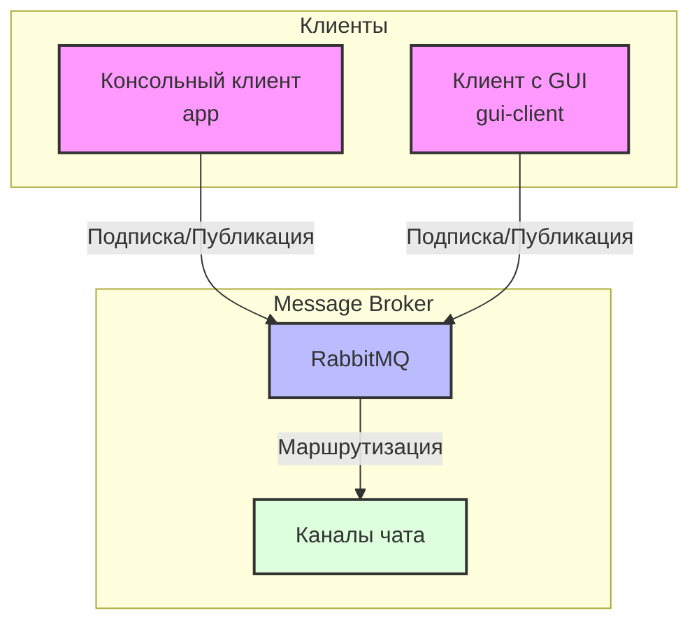

# Архитектура приложения

## Общий обзор

Приложение представляет собой систему чата с поддержкой множества каналов, состоящую из двух типов клиентов:
1. Консольный клиент (app)
2. Клиент с графическим интерфейсом (gui-client)

Все клиенты общаются напрямую через RabbitMQ без выделенной серверной части.

## Диаграмма архитектуры

## Компоненты системы

### Message Broker (RabbitMQ)

Центральный компонент системы, отвечающий за:
- Маршрутизацию сообщений между каналами
- Управление подписками клиентов на каналы
- Доставку сообщений всем подписчикам канала

### Консольный клиент (app)

Реализован на Kotlin и использует следующие технологии:
- RabbitMQ для обмена сообщениями
- Gradle для сборки проекта
- Kotlin Coroutines для асинхронной обработки

Основные компоненты:
- Консольный интерфейс для взаимодействия с пользователем
- Клиентская логика для работы с RabbitMQ

### Клиент с GUI (gui-client)

Реализован на Kotlin с использованием Kotlin Multiplatform:
- Kotlin Multiplatform для создания пользовательского интерфейса
- Gradle для сборки проекта
- Kotlin Coroutines для асинхронной работы 

Основные компоненты:
- GUI - графический интерфейс пользователя
- Клиентская логика для работы с RabbitMQ

## Взаимодействие компонентов

1. Клиент подключается к RabbitMQ серверу
2. При входе пользователь указывает своё имя
3. Клиент подписывается на канал (по умолчанию "general")
4. При отправке сообщения:
   - Клиент публикует сообщение в соответствующий канал
   - RabbitMQ доставляет сообщение всем подписчикам канала
5. При смене канала:
   - Клиент отписывается от текущего канала
   - Подписывается на новый канал